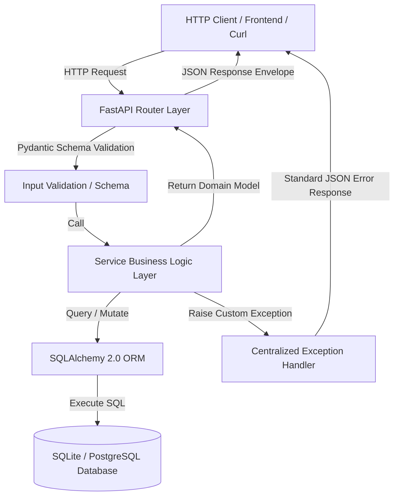

# 🚀 NEXORA API

> **A production-ready REST API for teams, projects, and task execution.**

Nexora API is a robust, modular, and enterprise-grade backend developed for **Innovation Hacks Full Stack Internship (Task 2 - Backend & REST API Development)**. Built using modern Python 3.12+, FastAPI, SQLAlchemy 2.0 ORM, and Pydantic v2, it features a scalable layered architecture, comprehensive input validation, centralized exception handling, predictable JSON response envelopes, and complete test coverage.

---

## ✨ Features

- **User Management**: Create, retrieve, update, and soft/hard delete users with email normalization and secure bcrypt password hashing.
- **Project Workspaces**: Multi-user project creation, ownership tracking, pagination, search, and real-time task statistics aggregations.
- **Task Pipeline**: Complete task lifecycle with strict status transitions (`todo` ➔ `in-progress` ➔ `done`), priority tagging (`low`, `medium`, `high`), assignee linkings, and due dates.
- **Dedicated Status Endpoint**: Dedicated atomic status patch endpoint (`PATCH /api/v1/tasks/{id}/status`).
- **Dashboard Analytics API**: High-performance dashboard summary (`GET /api/v1/dashboard/summary`) aggregating users, projects, total tasks, tasks by status, and tasks by priority.
- **Standardized Response Envelope**: Predictable JSON response envelopes for single items, paginated arrays, and structured error responses.
- **Centralized Error Handling**: Custom exception middleware handling `400 Bad Request`, `404 Not Found`, `409 Conflict`, `422 Validation Error`, and `500 Internal Server Error` without exposing stack traces or raw database errors.
- **Interactive API Documentation**: Polished OpenAPI schema rendering in Swagger UI and ReDoc.
- **Automated Test Suite**: 25+ automated Pytest tests verifying unit logic, business rules, edge cases, and API integration.

---

## 🏗️ Architecture

Nexora API uses a clean, decoupled **Layered Architecture** adhering to separation of concerns:



---

## 🛠️ Tech Stack

- **Language**: Python 3.12+
- **Framework**: FastAPI 0.110+
- **ORM**: SQLAlchemy 2.0+
- **Validation**: Pydantic v2 & Pydantic-Settings
- **Database**: SQLite (Production-ready interface configurable for PostgreSQL)
- **Security**: Passlib with Bcrypt password hashing
- **Testing**: Pytest & HTTPX TestClient
- **ASGI Server**: Uvicorn

---

## 📁 Project Structure

```text
nexora-api/
│
├── app/
│   ├── __init__.py
│   ├── main.py                # FastAPI application entrypoint & middleware configuration
│   │
│   ├── core/                  # Core infrastructure
│   │   ├── __init__.py
│   │   ├── config.py          # Centralized Pydantic settings & env loader
│   │   ├── database.py        # SQLAlchemy engine, session maker, and DB dependency
│   │   └── security.py        # Bcrypt hashing & password validation rules
│   │
│   ├── models/                # SQLAlchemy ORM Models
│   │   ├── __init__.py
│   │   ├── base.py
│   │   ├── user.py            # User entity & relationships
│   │   ├── project.py         # Project entity & relationships
│   │   └── task.py            # Task entity & relationships
│   │
│   ├── schemas/               # Pydantic v2 Schemas & Data Envelopes
│   │   ├── __init__.py
│   │   ├── common.py          # ResponseEnvelope, PaginatedData, ErrorEnvelope
│   │   ├── user.py            # User create, update, response schemas
│   │   ├── project.py         # Project create, update, response & stats schemas
│   │   ├── task.py            # Task enums, create, update, status patch schemas
│   │   └── dashboard.py       # Dashboard summary analytics schemas
│   │
│   ├── services/              # Domain Business Logic
│   │   ├── __init__.py
│   │   ├── user_service.py    # User business rules & persistence logic
│   │   ├── project_service.py # Project business rules & task stats logic
│   │   ├── task_service.py    # Task business rules, filters & status shifts
│   │   └── dashboard_service.py# Dashboard aggregations logic
│   │
│   ├── routers/               # API Endpoint Controllers
│   │   ├── __init__.py
│   │   ├── users.py           # /api/v1/users endpoints
│   │   ├── projects.py        # /api/v1/projects endpoints
│   │   ├── tasks.py           # /api/v1/tasks endpoints
│   │   └── dashboard.py       # /api/v1/dashboard/summary endpoint
│   │
│   ├── exceptions/            # Custom Exceptions & Handlers
│   │   ├── __init__.py
│   │   └── handlers.py        # Centralized HTTP & Validation error handlers
│   │
│   └── utils/                 # Utility helpers
│       ├── __init__.py
│       └── pagination.py      # Offsets, limits, and pagination metadata builders
│
├── tests/                     # Pytest Automated Test Suite
│   ├── __init__.py
│   ├── conftest.py            # In-memory SQLite fixtures & TestClient setup
│   ├── test_users.py          # 9 User tests (creation, dupes, validation, updates, deletion)
│   ├── test_projects.py       # 6 Project tests (creation, owner validation, stats, deletion)
│   ├── test_tasks.py          # 10 Task tests (CRUD, filters, status patch, 422 errors)
│   └── test_dashboard.py      # 3 Dashboard & Health tests
│
├── .env.example               # Template environment configuration
├── .env                       # Local environment configuration
├── .gitignore                 # Git ignore rules
├── requirements.txt           # Python dependencies
├── README.md                  # Complete technical documentation
├── seed.py                    # Database seeding script (8 users, 5 projects, 26 tasks)
└── LICENSE                    # MIT License
```

---

## 🚀 Installation & Setup

### 1. Clone the repository & Navigate to project directory

```bash
git clone https://github.com/your-username/nexora-api.git
cd nexora-api
```

### 2. Create and Activate Virtual Environment

```bash
# Windows
python -m venv .venv
.venv\Scripts\activate

# Linux / macOS
python3 -m venv .venv
source .venv/bin/activate
```

### 3. Install Dependencies

```bash
pip install -r requirements.txt
```

---

## ⚙️ Environment Configuration

Copy `.env.example` to `.env`:

```bash
cp .env.example .env
```

Configuration Options (`.env`):

```env
APP_NAME="Nexora API"
APP_ENV="development"
DATABASE_URL="sqlite:///./nexora.db"
SECRET_KEY="nexora-super-secret-development-key-change-in-production"
CORS_ORIGINS="http://localhost:3000,http://127.0.0.1:3000,http://localhost:8000"
```

---

## ▶️ Running the API

Start the Uvicorn ASGI development server:

```bash
uvicorn app.main:app --reload
```

The API server will run at:
- **Base URL**: `http://127.0.0.1:8000`
- **Health Check**: `http://127.0.0.1:8000/health`
- **Swagger Documentation**: `http://127.0.0.1:8000/docs`
- **ReDoc Documentation**: `http://127.0.0.1:8000/redoc`

---

## 🌱 Seed Demo Data

To populate the database with realistic SaaS data (8 users, 5 projects, and 26 tasks across varied statuses and priorities):

```bash
python seed.py
```

Output:
```text
🌱 Starting Nexora API database seed...
  - Creating Users...
    ✓ Created 8 users.
  - Creating Projects...
    ✓ Created 5 projects.
  - Creating Tasks...
    ✓ Created 26 tasks.
🎉 Database seeding completed successfully!
```

---

## 🧪 Running Automated Tests

Run the complete Pytest suite with detailed output:

```bash
pytest -v
```

All 28 tests will run against an isolated in-memory SQLite database instance.

---

## 📚 API Documentation

FastAPI automatically generates interactive OpenAPI 3.0 documentation:

- **Swagger UI**: [`http://127.0.0.1:8000/docs`](http://127.0.0.1:8000/docs)
- **ReDoc UI**: [`http://127.0.0.1:8000/redoc`](http://127.0.0.1:8000/redoc)
- **Raw OpenAPI Schema**: [`http://127.0.0.1:8000/openapi.json`](http://127.0.0.1:8000/openapi.json)

---

## 🔌 API Endpoints Table

| Category | HTTP Method | Endpoint | Description | Status Code |
| :--- | :--- | :--- | :--- | :--- |
| **Health** | `GET` | `/health` | Service health status check | `200 OK` |
| **Users** | `POST` | `/api/v1/users` | Register a new user | `201 Created` |
| | `GET` | `/api/v1/users` | Get paginated users (search supported) | `200 OK` |
| | `GET` | `/api/v1/users/{user_id}` | Get user details by ID | `200 OK` |
| | `PATCH` | `/api/v1/users/{user_id}` | Update user fields | `200 OK` |
| | `DELETE` | `/api/v1/users/{user_id}` | Delete user by ID | `204 No Content` |
| **Projects** | `POST` | `/api/v1/projects` | Create a new project | `201 Created` |
| | `GET` | `/api/v1/projects` | Get paginated projects (filter/search/sort) | `200 OK` |
| | `GET` | `/api/v1/projects/{project_id}` | Get project by ID + task stats breakdown | `200 OK` |
| | `PATCH` | `/api/v1/projects/{project_id}` | Update project name/description | `200 OK` |
| | `DELETE` | `/api/v1/projects/{project_id}` | Delete project & cascade tasks | `204 No Content` |
| **Tasks** | `POST` | `/api/v1/tasks` | Create a new task | `201 Created` |
| | `GET` | `/api/v1/tasks` | Get tasks (filter by project, assignee, status, priority) | `200 OK` |
| | `GET` | `/api/v1/tasks/{task_id}` | Get task details by ID | `200 OK` |
| | `PATCH` | `/api/v1/tasks/{task_id}` | Update task details | `200 OK` |
| | `PATCH` | `/api/v1/tasks/{task_id}/status` | Update task status (`todo`, `in-progress`, `done`) | `200 OK` |
| | `DELETE` | `/api/v1/tasks/{task_id}` | Delete task by ID | `204 No Content` |
| **Dashboard**| `GET` | `/api/v1/dashboard/summary` | Real-time system analytics & breakdown | `200 OK` |

---

## 📦 Example Requests (cURL)

### 1. Create a User
```bash
curl -X POST "http://127.0.0.1:8000/api/v1/users" \
  -H "Content-Type: application/json" \
  -d '{
    "name": "Sai Krishna",
    "email": "sai@example.com",
    "password": "StrongPassword123"
  }'
```

### 2. Create a Project
```bash
curl -X POST "http://127.0.0.1:8000/api/v1/projects" \
  -H "Content-Type: application/json" \
  -d '{
    "name": "AI Resume Analyzer",
    "description": "An AI-powered candidate resume parsing engine",
    "owner_id": 1
  }'
```

### 3. Create a Task
```bash
curl -X POST "http://127.0.0.1:8000/api/v1/tasks" \
  -H "Content-Type: application/json" \
  -d '{
    "title": "Build resume parser",
    "description": "Implement resume parsing pipeline",
    "project_id": 1,
    "assignee_id": 1,
    "status": "todo",
    "priority": "high",
    "due_date": "2026-09-30"
  }'
```

### 4. Update Task Status
```bash
curl -X PATCH "http://127.0.0.1:8000/api/v1/tasks/1/status" \
  -H "Content-Type: application/json" \
  -d '{
    "status": "in-progress"
  }'
```

### 5. Get Dashboard Summary
```bash
curl -X GET "http://127.0.0.1:8000/api/v1/dashboard/summary"
```

---

## 📤 Example Responses

### Success Single Resource (`200 OK` / `201 Created`)
```json
{
  "success": true,
  "data": {
    "id": 1,
    "name": "AI Resume Analyzer",
    "description": "An AI-powered candidate resume parsing engine",
    "owner_id": 1,
    "created_at": "2026-09-14T13:20:00.000000",
    "updated_at": "2026-09-14T13:20:00.000000"
  }
}
```

### Success Paginated Resource (`200 OK`)
```json
{
  "success": true,
  "data": {
    "items": [...],
    "pagination": {
      "page": 1,
      "page_size": 10,
      "total": 26,
      "total_pages": 3
    }
  }
}
```

### Dashboard Summary Response (`200 OK`)
```json
{
  "success": true,
  "data": {
    "users": 8,
    "projects": 5,
    "tasks": 26,
    "tasks_by_status": {
      "todo": 9,
      "in-progress": 9,
      "done": 8
    },
    "tasks_by_priority": {
      "low": 6,
      "medium": 11,
      "high": 9
    }
  }
}
```

### Error Response (`404 Not Found`)
```json
{
  "success": false,
  "error": {
    "code": "PROJECT_NOT_FOUND",
    "message": "Project with ID 99 specified was not found",
    "details": []
  }
}
```

### Validation Error Response (`422 Unprocessable Entity`)
```json
{
  "success": false,
  "error": {
    "code": "VALIDATION_ERROR",
    "message": "Request validation failed",
    "details": [
      {
        "field": "status",
        "message": "Input should be 'todo', 'in-progress' or 'done'",
        "type": "enum"
      }
    ]
  }
}
```

---

## 🔐 Security Practices

- **Bcrypt Password Hashing**: User passwords are securely hashed using Passlib (`bcrypt`) before database insertion. `password_hash` is stripped from all API response schemas.
- **Input Sanitization & Normalization**: Emails are automatically trimmed, validated, and normalized to lowercase. String fields are validated against minimum/maximum length constraints.
- **Environment Isolation**: Database connection strings, app secrets, and environment flags are managed strictly via `.env` files and `pydantic-settings`.
- **CORS Protection**: Access control headers configurable via `CORS_ORIGINS`.

---

## 🚀 Future Improvements

- **PostgreSQL Database Driver**: Seamless migration to production PostgreSQL via Alembic migrations.
- **JWT & Role-Based Access Control (RBAC)**: Secure access tokens and project permission scopes (Admin, Editor, Viewer).
- **Redis Caching**: Cache heavy analytics endpoints like `/api/v1/dashboard/summary`.
- **Docker & Docker-Compose**: Containerized deployment setup for production environments.
- **CI/CD Pipeline**: GitHub Actions workflow for automated testing and linting checks.

---

## 📜 License

This project is open-source and released under the [MIT License](LICENSE).
